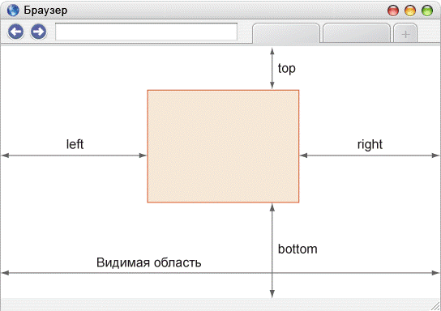
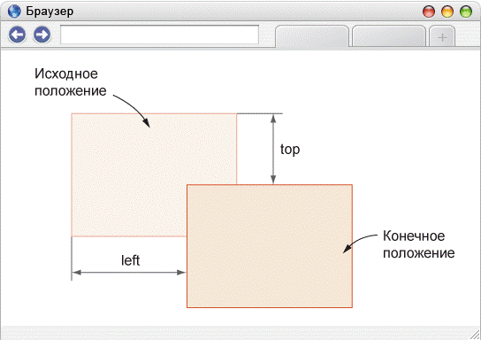

# Позиционирование

Позиционированием называется положение элемента в системе координат. Различают четыре типа позиционирования: нормальное, абсолютное, фиксированное и относительное.

## Нормальное позиционирование

Если для элемента свойство position не задано или его значение static, элемент выводится в потоке документа как обычно, то есть отображаются на странице в том порядке, как они идут в исходном коде HTML. Свойства left, top, right, bottom игнорируются.

## Абсолютное позиционирование

Абсолютное положение слоя задаётся значением absolute свойства position. При абсолютном позиционировании элемент выпадает из потока документа и координаты top/bottom/left/right отсчитываются относительно ближайшего позиционированного родителя, т.е. у которого установлено свойство position не равное static. Если такого родителя нет – то относительно документа.

## Фиксированное положение

Фиксированное положение слоя задаётся значением fixed свойства position и по своему действию похоже на абсолютное позиционирование. Но в отличие от него привязывается к указанной свойствами left, top, right и bottom точке на экране и не меняет своего положения при прокрутке веб-страницы. Ещё одна разница от absolute заключается в том, что при выходе фиксированного слоя за пределы видимой области справа или снизу от неё, не возникает полос прокрутки.

## Относительное позиционирование

Если задать значение relative свойства position, то элемент позиционируется относительно его исходного положения. Свойства left, top, right и bottom изменяет позицию элемента, сдвигая в ту или иную сторону от его первоначального расположения.  

 
