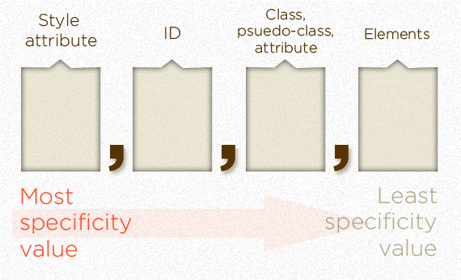

# Каскад, наследование

## Каскадирование

В CSS все стили идут каскадом сверху вниз, что позволяет добавлять другой стиль или переопределять его. Под каскадом в понимается одновременное применение разных стилевых правил к элементам документа — с помощью подключения нескольких стилевых файлов, наследования свойств и других методов. Чтобы браузер мог определить без конфликтов какое правило применить к тому или иному элементу, используются приоритеты.

Ниже приведены приоритеты, которые использует браузер при обработке стилевых правил. Чем выше в списке находится пункт, тем ниже его приоритет, и наоборот.

1. Стиль браузера.
2. Стиль автора.
3. Стиль пользователя.
4. Стиль автора с добавлением !important.
5. Стиль пользователя с добавлением !important.

## !important

!important позволяет повысить приоритет стиля, используется дл переопределения ранее заданных стилевых правил.

Пример:

```css
Свойство: значение !important
```

## Специфичность

Если к одному элементу одновременно применяются противоречивые стилевые правила, то более высокий приоритет имеет правило, у которого значение специфичности селектора больше. Специфичность это некоторая условная величина, вычисляемая следующим образом:
- за каждый идентификатор (в дальнейшем будем обозначать их как "a") начисляется 100
- за каждый класс и псевдокласс ("b") начисляется 10
- за каждый селектор тега и псевдоэлемент ("c") начисляется 1. 

Складывая указанные значения в определённом порядке, получим значение специфичности для данного селектора.

```css 
*              {} /* a=0 b=0 c=0 -> специфичность = 0   */
li             {} /* a=0 b=0 c=1 -> специфичность = 1   */
li:first-line  {} /* a=0 b=0 c=2 -> специфичность = 2   */
ul li          {} /* a=0 b=0 c=2 -> специфичность = 2   */
ul ol+li       {} /* a=0 b=0 c=3 -> специфичность = 3   */
ul li.red      {} /* a=0 b=1 c=2 -> специфичность = 12  */
li.red.level   {} /* a=0 b=2 c=1 -> специфичность = 21  */
#t34           {} /* a=1 b=0 c=0 -> специфичность = 100 */
#content #wrap {} /* a=2 b=0 c=0 -> специфичность = 200 */
```

Встроенный стиль, добавляемый к тегу через атрибут style, имеет специфичность 1000, поэтому всегда перекрывает связанные и глобальные стили. Однако добавление !important перекрывает в том числе и встроенные стили.

Если два селектора имеют одинаковую специфичность, то применяться будет тот стиль, что указан в коде ниже.



## Наследование

Наследование в CSS — механизм, с помощью которого значения свойств элемента-родителя передаются его элементам-потомкам.

Стили, присвоенные некоторому элементу, наследуются всеми потомками (вложенными элементами), если они не переопределены явно. Например, размер шрифта и его цвет достаточно применить к body, чтобы все элементы внутри имели те же свойства.
