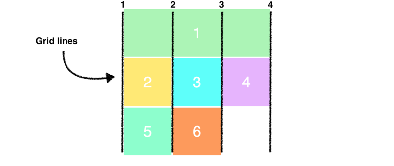
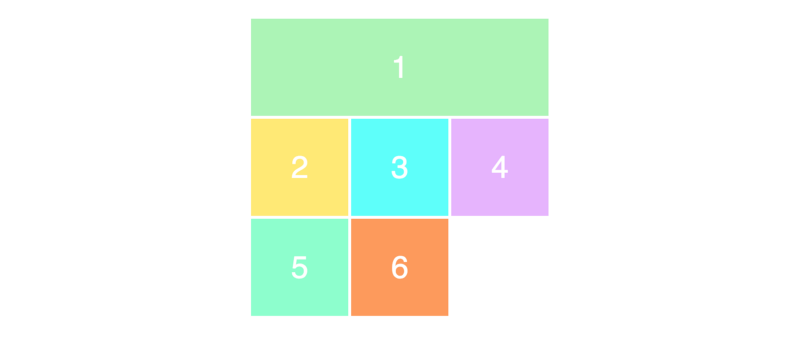
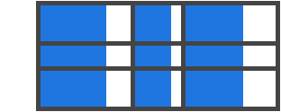
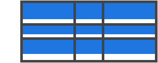
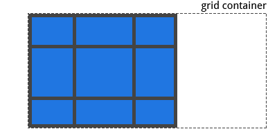
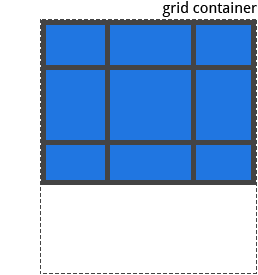

# Grid

CSS Grid Layout - это двумерная система, которая может обрабатывать как колонки так и строки.

Двумя основными компонентами CSS Grid являются контейнер сетки и дочерние элементы (прямые потомки).

```html
<div class="container">
  <div class="item item-1"></div>
  <div class="item item-2"></div>
  <div class="item item-3"></div>
  <div class="item item-4"></div>
  <div class="item item-5"></div>
  <div class="item item-6"></div>
</div>
```

Первый шаг - это задать контейнеру свойство `display: grid`:

```css
.container {
    display: grid;
}
```

## Столбцы и строки

Свойства `grid-template-columns` и `grid-template-row` отвечают за то, как выкладываются колонки и строки грида. Свойства принимают ряд значений через пробел, определяющих размер каждой колонки/строки; сколько значений указано, столько и будет колонок/строк.

Например, четырёхколоночный грид из колонок шириной по 250px можно задать так:

```css
grid-template-columns: 250px 250px 250px 250px;
```

Ту же самую раскладку можно выразить с помощью удобного ключевого слова `repeat`.

```css
grid-template-columns: repeat(4, 250px);
```

Пример: 
```css 
.container {
    display: grid;
    grid-template-columns: 200px 50px 100px;
    grid-template-rows: 100px 30px;
}
```

Этот грид из 3-х колонок 2-х строк будет выглядеть так:


## Grid gaps

Свойства `grid-column-gap`, `grid-row-gap`, `grid-gap` задают размер интервалов в грид-раскладке. 

`grid-gap` может принимать одно или два значения, при указании двух значений определяется размеры интервалов и для рядов, и для колонок.

Пример:
```css
.container {
  display: grid;
  grid-template-columns: repeat(3, 50px);
  grid-template-rows: repeat(3, 50px);
  grid-gap: 1rem;
}
```


## Единица fr

Единица fr занимает долю доступного места. Например, если бы доступное место составляло 900px, то первый получил бы 1/3, а второй – 2/3 от этих 900px:

```css
.container {
  display: grid;
  grid-template-columns: 1fr 2fr;
}
```

## Функция minmax

Задает минимум, до которого можно ужимать полосу, и максимум, на который она может растянуться.

```css
minmax(min, max)
```

Пример:
```css
display: grid;
grid-template-columns: minmax(100px, 200px) 1fr 1fr;
```


## Расположение элементов

Обратите внимание, как формируются линии сетки в CSS Grid:



Для позиционирования и изменения размера элементов используются свойства `grid-column` и `grid-row`. Например, если мы хотим, чтобы item1 начинался с первой линии сетки и заканчивался на четвертой линии, то необходимо указать свойства следующим образом:

```css
.item1 {
    grid-column-start: 1;
    grid-column-end: 4;
}
```
И это будет выглядеть так:



Сокращённая запись для примера выше:

```css
.item1 {
    grid-column: 1 / 4;
}
```

## Выравнивание контента

### Свойство justify-items

Выравнивает содержимое вдоль оси **строки**. Это значение применяется ко всем элементам сетки внутри контейнера.

Значения:

- start - выравнивает содержимое по левой стороне области;
- end - выравнивает содержимое по правой стороне области;
- center - выравнивает содержимое по центру области;
- stretch - заполняет всю ширину области (по умолчанию);

```css
.container {
  justify-items: start | end | center | stretch;
}
```

Пример:

```css
.container {
  justify-items: start;
}
```



### Свойство align-items

Выравнивает содержимое вдоль оси **столбца**. Значение применяется ко всем элементам сетки внутри контейнера.

Значения:

- start - выравнивание элементов по верхней части области;
- end - выравнивание элементов по нижней части области;
- center - выравнивание элементов по центру области;
- stretch - заполняет всю высоту области (по умолчанию);

```css
.container {
  align-items: start | end | center | stretch;
}
```

Пример:

```css
.container {
  align-items: start;
}
```



### Свойство justify-self

Выравнивает содержимое элемента вдоль оси **строки**. Это значение применяется к содержимому внутри **отдельного элемента**.

```css
.item {
  justify-self: start | end | center | stretch;
}
```

Пример:

```css
.item-a {
  justify-self: start;
}
```


### Свойство align-self

Выравнивает содержимое элемента вдоль оси **столбца**. Это значение применяется к содержимому внутри **отдельного элемента**.

```css
.item {
  align-self: start | end | center | stretch;
}
```

Пример:

```css
.item-a {
  align-self: start;
}
```


## Выравнивание сетки

### Свойство justify-content

Используется для выравнивания всей сетки внутри контейнера.

Значения:

- start - выравнивает сетку по левой стороне контейнера;
- end - выравнивает сетку по правой стороне контейнера;
- center - выравнивает сетку по центру контейнера;
- stretch - масштабирует элементы чтобы сетка могла заполнить всю ширину контейнера;
- space-around - одинаковое пространство между элементами, и полуразмерные отступы по краям;
- space-between - одинаковое пространство между элементами, без отступов по краям;
- space-evenly - одинаковое пространство между элементами, и полноразмерные отступы по краям;

```css
.container {
  justify-content: start | end | center | stretch | space-around | space-between | space-evenly;
}
```

Пример:

```css
.container {
  justify-content: start;
}
```



### Свойство align-content

Используется для выравнивания всей сетки внутри контейнера по вертикали.

```css
.container {
  align-content: start | end | center | stretch | space-around | space-between | space-evenly;  
}
```

Пример:

```css
.container {
  align-content: start;
}
```
